<div align="center">
   
   
   <br>
   
   
   
   
   
   
   <br>
   <br>
   <div>
      <a href="https://github.com/JamesNZL/flow-toggl-plugin/issues">
         
      </a>
      <a href="https://github.com/JamesNZL/flow-toggl-plugin/pulls">
         
      </a>
      <a href="https://github.com/JamesNZL/flow-toggl-plugin/actions/workflows/release.yml">
         
      </a>
      <a href="https://github.com/JamesNZL/flow-toggl-plugin/commits">
         
      </a>
   </div>
</div>

# Flow Toggl Plugin

A performant [Toggl Track](https://track.toggl.com/timer) plugin for [Flow Launcher](https://flowlauncher.com/) to bring time tracking right to your fingertips.

- [Features](#features)
- [Commands](#commands)
- [Demos](#demos)
- [Setup Instructions](#setup-instructions)
- [Command Reference](#command-reference)
- [Licence](#licence)

# Features

- Simple, user-friendly interface
- Support for projects, clients, and workspaces
- Coloured icons for projects
- Human-friendly date and time display
- Open source
- Private and secure—all data is stored locally!

# Commands

- `Start` new time entries
- `Stop` currently running time entries
- `Continue` a previously tracked time entry
- `Edit` a previously tracked time entry
- `Delete` a previously tracked time entry 
- `Reports` of tracked time by projects, clients, and entries
- `Browser` quick-launch shortcut

# Demos

## `tgl`


## `tgl reports`


# Setup Instructions

1. Install the plugin.
    ```
    pm install Toggl Track
    ```

2. Paste your Toggl Track API key into the plugin settings.
    > This can be found at the bottom of your Toggl Track [profile settings](https://track.toggl.com/profile) page.

3. Trigger the plugin with the (configurable) action keyword `tgl`.

# Command Reference

> **Note**  
> This command reference applies to version `v3.0.0`.

| Icon                                         | Link                        |
| -------------------------------------------- | --------------------------- |
|       | [`tgl`](#tgl)               |
|     | [`start`](#tgl-start)       |
|      | [`stop`](#tgl-stop)         |
|  | [`continue`](#tgl-continue) |
|      | [`edit`](#tgl-edit)         |
|    | [`delete`](#tgl-delete)     |
|   | [`reports`](#tgl-reports)   |
|   | [`browser`](#tgl-browser)   |
|       | [`help`](#tgl-help)         |
|   | [`refresh`](#tgl-refresh)   |

## `tgl`

### Description
> :memo: The action keyword lists all currently executable plugin commands.

### Usage Examples
- `tgl a` > `tgl start`
- `tgl o` > `tgl stop`
- `tgl c` > `tgl continue`
- `tgl ed` > `tgl edit`
- `tgl de` > `tgl delete`
- `tgl re` > `tgl reports`

### Screenshots
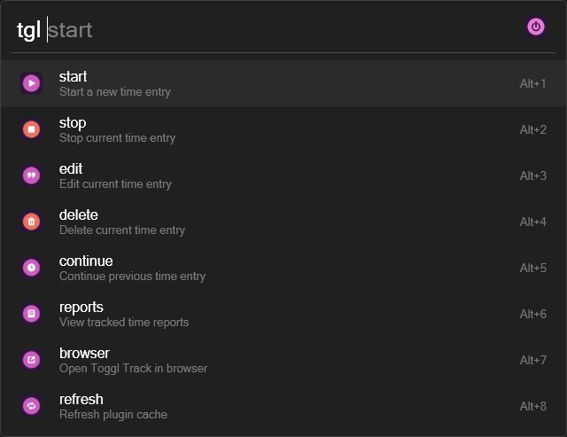

## `tgl start`

### Description
> :memo: Start a new time entry.

### Usage Examples
- `tgl start no-project`
- `tgl start project-one Start project one`
- `tgl start flow-toggl-plugin Release v1.2.1 -t -10`
- `tgl start no-project New time entry -t 30s`

### Flags
| Name      | Flag | Description                                                               | Example          |
| --------- | ---- | ------------------------------------------------------------------------- | ---------------- |
| Time Span | `-t` | Offset the starting time of the new time entry with a specified time span | `-t -30 seconds` |

### Notes and Warnings
> **Note**  
> 1. If a time entry is currently running, `tgl start` will first stop the running time entry before starting the new time entry.
> 2. If a time entry is not currently running, there will be an option to start the new time entry at the previous stop time (if one exists).

> **Warning**  
> 1. The `Time Span` flag must be the entered after the time entry description. Anything entered after the `-t` flag will be ignored.
> 2. Project selection cannot be `Tab` auto-completed; selection must be made with the `Enter` action key due to Flow limitations.

### Screenshots


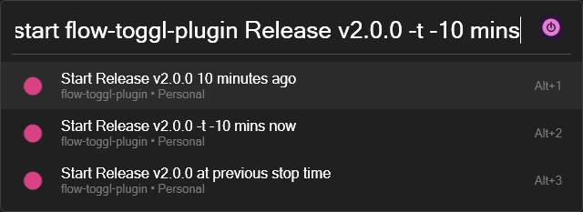

## `tgl stop`

### Description
> :memo: Stop the current time entry.

### Usage Examples
- `tgl stop`
- `tgl stop -T -4`
- `tgl stop -T 1h`

### Flags
| Name          | Flag | Description                                                                   | Example          |
| ------------- | ---- | ----------------------------------------------------------------------------- | ---------------- |
| End Time Span | `-T` | Offset the stopping time of the current time entry with a specified time span | `-T -30 seconds` |

### Notes
> **Note**  
> 1. This command is only available if there is a currently running time entry.
> 2. Typing the time entry name (or anything else, other than the `End Time Span` flag) has no effect.

### Screenshots
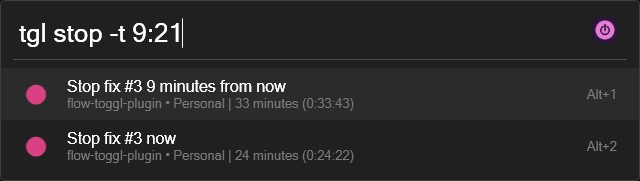

## `tgl continue`

### Description
> :memo: Continue a previous time entry.

### Usage Examples
- `tgl continue [previous time entry description]`

### Notes
> **Note**  
> 1. `tgl continue` is a short-hand command to autofill the `tgl start` command, which is used for the actual time entry creation.
> 1. The list is guaranteed to contain all time entries tracked within the preceeding 12 months.

### Screenshots
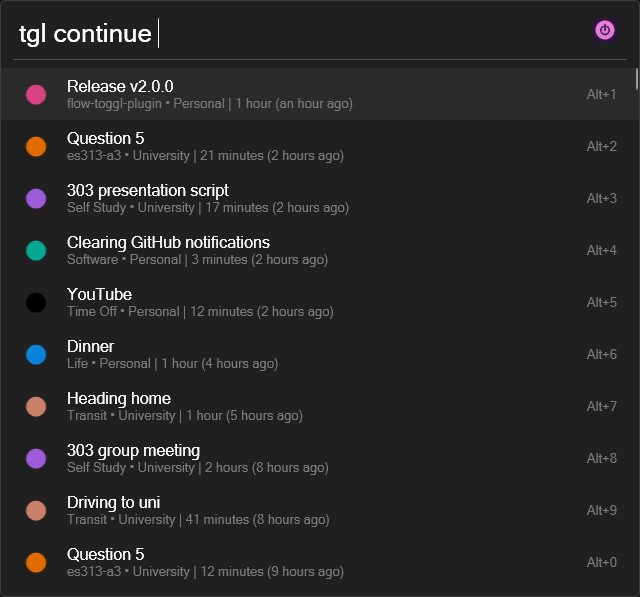

## `tgl edit`

### Description
> :memo: Edit a previous time entry.

### Usage Examples
- `tgl edit [previous time entry description]` > `tgl edit -C` > `tgl edit New time entry description`
- `tgl edit [previous time entry description]` > `tgl edit -t 20s -T 1h`
- `tgl edit [previous time entry description]` > `tgl edit -p` > `tgl edit no-project [previous time entry description]`
- `tgl edit [previous time entry description]` > `tgl edit -p` > `tgl edit project-one New time entry description`

### Flags
| Name              | Flag | Description                                                                    | Example          |
| ----------------- | ---- | ------------------------------------------------------------------------------ | ---------------- |
| Time Span         | `-t` | Offset the starting time of the selected time entry with a specified time span | `-t -30 seconds` |
| End Time Span     | `-T` | Offset the stopping time of the selected time entry with a specified time span | `-T -30 seconds` |
| Edit Project      | `-p` | Edit the project of the selected time entry                                    | `-p new-project` |
| Clear Description | `-C` | Empty the time entry description from the Flow search bar                      | `-C`             |

### Notes and Warnings
> **Note**  
> 1. If an `End Time Span` is specified, the time entry will be stopped (if it is currently running).
> 2. The `Clear Description` flag will only empty the time entry description from the Flow search bar, so a replacement can be input quickly.
>    > **Note**  
>    > To actually clear a time entry's description, use the `Clear Description` flag then hit the `Enter` action key to save.
> 4. `tgl edit` will use the entered description to perform a fuzzy match against all previously tracked time entries (within the past 12 months), allowing you to quickly apply a previous time entry's description/project/etc.

> **Warning**  
> 1. The `Time Span`/`End Time Span` flags must be the entered after the time entry description. Anything entered after the flag(s) will be ignored.
> 2. Project selection cannot be `Tab` auto-completed; selection must be made with the `Enter` action key due to Flow limitations.
> 3. The list of editable time entries is only guaranteed to contain the `1000` most recent time entries due to Toggl limitations.
> 4. The `Edit Project` flag will reset the Flow search bar (ie other flags/the new description will be lost), so use this before typing anything else.

### Screenshots
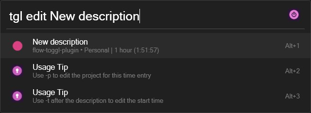

## `tgl delete`

### Description
> :memo: Delete a previous time entry.

### Usage Examples
- `tgl delete [previous time entry description]`

### Notes
> **Note**  
> 1. Typing anything on the deletion confirmation page (ie after selecting a time entry) has no effect.

### Screenshots
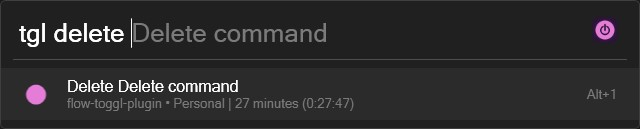

## `tgl reports`

### Description
> :memo: View summary and detailed tracked time reports.

### Usage Examples
- `tgl reports day projects project-one`
- `tgl reports week clients client-one`
- `tgl reports month entries [time entry description search query]`
- `tgl reports week-3 projects no-project [time entry description search query]`

### Flags and Modifiers
| Name           | Flag | Description                                                  | Example |
| -------------- | ---- | ------------------------------------------------------------ | ------- |
| Show Stop Time | `-S` | Show time entry stop times when displaying a detailed report | `-S`    |

| Name               | Modifier          | Description                                  | Example   |
| ------------------ | ----------------- | -------------------------------------------- | --------- |
| Report Span Offset | `[span]-[offset]` | Offset the report span by a specified offset | `month-1` |

### Notes
> **Note**  
> 1. Reports of tracked time entries can be filtered with a fuzzy search.
> 2. Selecting a time entry will autofill the `tgl start` command.

### Screenshots
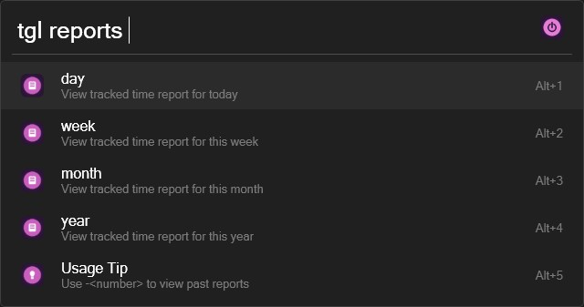

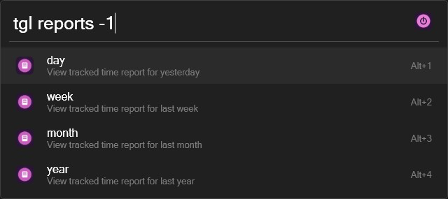

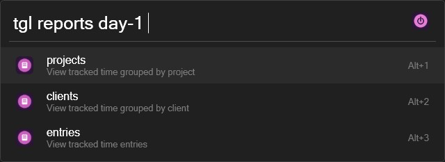

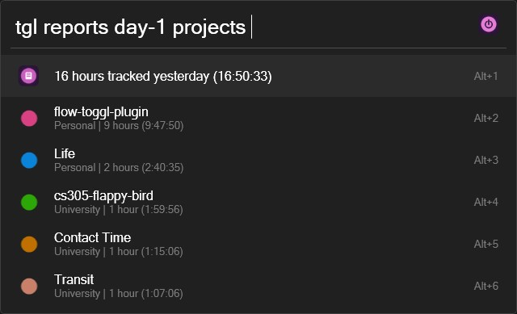

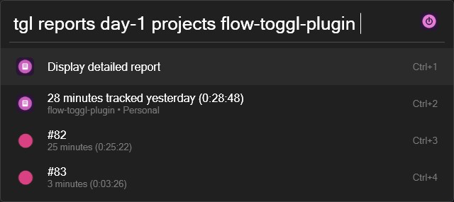

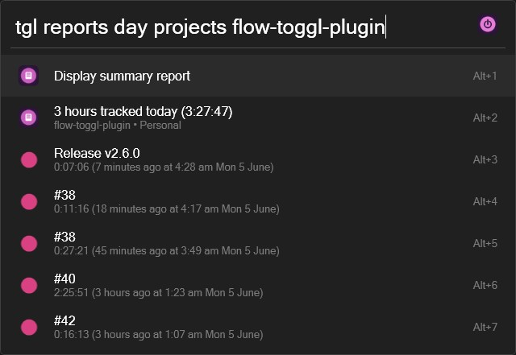

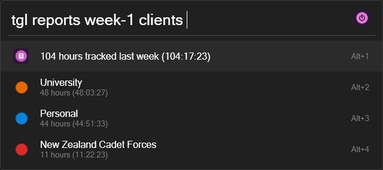

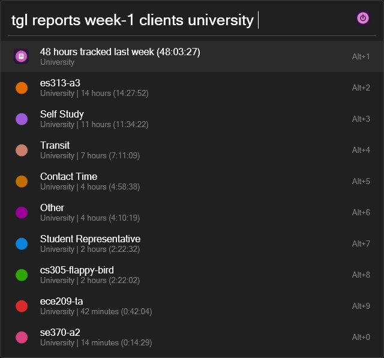

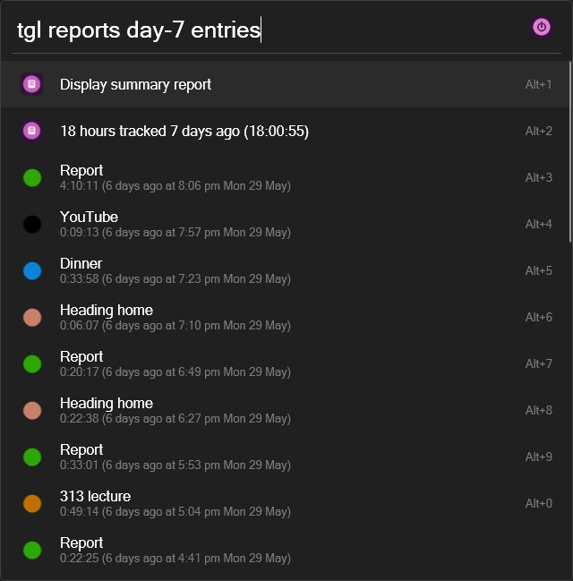

## `tgl browser`

### Description
> :memo: Open the [Toggl Track](https://track.toggl.com/timer) website in a browser.

### Usage Examples
- `tgl browser`

## `tgl help`

### Description
> :memo: Open plugin command reference.

### Usage Examples
- `tgl help`

### Notes
> **Note**  
> 1. This command simply opens this `README` file to [Command Reference](#command-reference).

## `tgl refresh`

### Description
> :memo: Refresh plugin cache.

### Usage Examples
- `tgl refresh`

### Notes
> **Note**  
> 1. This command should only rarely need to be used, as the cache is automatically cleared after what should be quite sane cache expiration periods.
> 2. The exception is for any changes made in [Toggl Track](https://track.toggl.com/timer) to the following, as these are cached for up to `3` days:
>    1. Project names/colours/clients,
>    2. Client names,
>    3. Reports time zone, and
>    4. First day of the week.

# Licence

The source code for this plugin is licensed under MIT.
