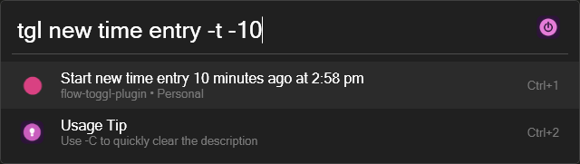
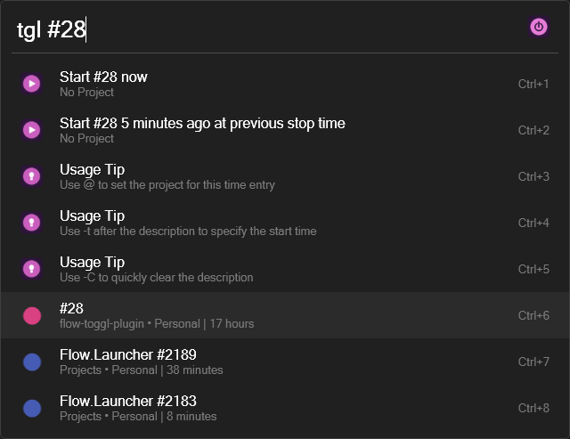
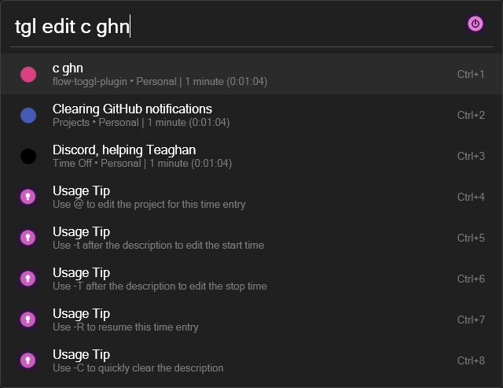
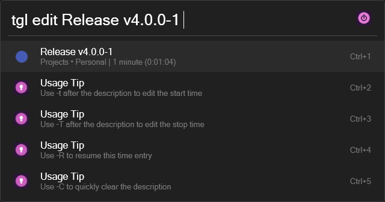
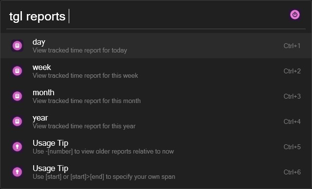

<div align="center">
   <a href="https://flowlauncher.com/">
      
   </a>
   <a href="https://track.toggl.com/timer">
      
   </a>
   <br>
   
   
   
   
   
   
   <br>
   <br>
   <div>
      <a href="https://github.com/JamesNZL/flow-toggl-plugin/issues">
         
      </a>
      <a href="https://github.com/JamesNZL/flow-toggl-plugin/pulls">
         
      </a>
      <a href="https://github.com/JamesNZL/flow-toggl-plugin/actions/workflows/release.yml">
         
      </a>
      <a href="https://github.com/JamesNZL/flow-toggl-plugin/commits">
         
      </a>
   </div>
</div>

# Flow Toggl Plugin

A performant [Toggl Track](https://track.toggl.com/timer) plugin for [Flow Launcher](https://flowlauncher.com/) to bring time tracking right to your fingertips.

- [Features](#features)
- [Commands](#commands)
- [Demos](#demos)
- [Setup Instructions](#setup-instructions)
- [Command Reference](#command-reference)
- [Licence](#licence)

# Features

- Powerful, speed-optimised interface
- Support for projects, clients, and workspaces
- Coloured icons for projects
- Human-friendly date and time display
- Open source
- Private and secure—all data is stored locally!

# Commands

- `Start` new time entries
- `Continue` a previously tracked time entry
- `Stop` currently running time entries
- `Edit` a previously tracked time entry
- `Delete` a previously tracked time entry 
- `Reports` of tracked time by projects, clients, and entries
- `Browser` quick-launch shortcut

# Demos

## `tgl`


## `tgl reports`


# Setup Instructions

1. Install the plugin.
    ```
    pm install Toggl Track
    ```

2. Paste your Toggl Track API key into the plugin settings.
    > This can be found at the bottom of your Toggl Track [profile settings](https://track.toggl.com/profile) page.

3. Trigger the plugin with the (configurable) action keyword `tgl`.

# Command Reference

> **Note**  
> This command reference applies to version `v4.0.0-0`.  

**Older Versions**:
- [`v3.0.1`](https://github.com/JamesNZL/flow-toggl-plugin/tree/9be3a06727104b3bed38e8011e9e4a8073eec0e0#command-reference)
- [`v3.0.0`](https://github.com/JamesNZL/flow-toggl-plugin/tree/25611682dd63d0eef2a2e337f94309eca00cb0a4#command-reference) (created command reference)

## Quick Links

| Icon                                         | Link                        |
| -------------------------------------------- | --------------------------- |
|       | [`tgl`](#tgl-1)             |
|     | [`start`](#tgl-start)       |
|  | [`continue`](#tgl-continue) |
|      | [`stop`](#tgl-stop)         |
|      | [`edit`](#tgl-edit)         |
|    | [`delete`](#tgl-delete)     |
|   | [`reports`](#tgl-reports-1) |
|   | [`browser`](#tgl-browser)   |
|       | [`help`](#tgl-help)         |
|   | [`refresh`](#tgl-refresh)   |

---

## `tgl`

### Description
> :memo: The action keyword lists:
>    1. the result(s) to start a new time entry,
>    2. past time entries that fuzzy match the current input, and
>    3. all currently executable plugin commands.

#### `tgl` with no further input
When the plugin is triggered with no further input, the list of results will contain:
1. `Start an empty time entry now`,
2. `Start an empty time entry [x time] ago at previous stop time`, and
3. A list of currently executable commands.

> **Note**  
> The `previous stop time` action is only available if:
> 1. There is a past time entry, and
> 2. There is no currently running time entry.

> **Note**  
> Relevant `Usage Tip`s will also be displayed if `Show Usage Results: Tips` is enabled in the plugin settings.


#### `tgl [command name]`
When followed by a recognised command name, the respective command will be auto-triggered and the list of results will contain its respective actions.


> **Note**  
> To create a new time entry that starts with a command name, you may escape the command with a backslash (`\`) character.  
> 

#### `tgl ...`
When followed by anything other than a command name, the list of results will contain:
1. `Start ... now`,
2. `Start ... [x time] ago at previous stop time`,
3. A list of past time entries whose descriptions fuzzy match the `...` query, and
4. A list of currently executable commands that fuzzy match the `...` query.

> **Note**  
> The `previous stop time` action is only available if:
> 1. There is a past time entry, and
> 2. There is no currently running time entry.

> **Note**  
> Relevant `Usage Tip`s will also be displayed if `Show Usage Results: Tips` is enabled in the plugin settings.


### Usage Examples
- `tgl`
- `tgl stop`
- `tgl edit`
- `tgl reports`

---

## `tgl start`

### Description
> :memo: Start a new time entry.

> **Note**  
> This command exists at the top-level and does not have a command (ie no `tgl start`).

### Usage Examples
- `tgl`
- `tgl new time entry`
- `tgl @[project]`
- `tgl new time entry@[project]`
- `tgl Release v1.2.1 -t -10`
- `tgl New time entry -t 30s @[project]`

### Symbols, Flags, and Key Modifiers
| Name                     | Symbol | Description                          | Example              |
| ------------------------ | ------ | ------------------------------------ | -------------------- |
| Project Selection Prefix | `@`    | Set a project for the new time entry | `@flow-toggl-plugin` |

| Name      | Flag | Description                                                               | Example          |
| --------- | ---- | ------------------------------------------------------------------------- | ---------------- |
| Time Span | `-t` | Offset the starting time of the new time entry with a specified time span | `-t -30 seconds` |

| Name                               | Key Modifier | Description                                                                   | Example                                           |
| ---------------------------------- | ------------ | ----------------------------------------------------------------------------- | ------------------------------------------------- |
| Quick-Start from Project Selection | `Alt`        | Instantly start the new time entry directly from the project selection screen | `tgl Release v4.0.0@flow-toggl` > `Alt` + `Enter` |

### Notes and Warnings
> **Note**  
> 1. Any currently running time entry will first be stopped before starting the new time entry to prevent overlapping entries (mimics Toggl Track behaviour)
> 2. If a time entry is not currently running, there will be an option to start the new time entry at the previous stop time (if one exists).
> 3. To include a command symbol/flag in your time entry description, you can escape it with a backslash (`\`), eg `tgl Email james\@jamesnzl.xyz \-t -t -5`

> **Warning**  
> 1. The `Time Span` flag must be the entered after the time entry description. Anything entered after the `-t` flag will be ignored.
> 2. Due to a current [Flow Launcher bug](https://github.com/Flow-Launcher/Flow.Launcher/issues/2191), the `Alt` quick-start will execute if you use the `Alt` + `number` hotkey to select a project. This can be circumvented for the time being by changing your `Open Result Modifier Key` to `Ctrl` in the Flow `Hotkey` settings.

### Screenshots




---

## `tgl continue`

### Description
> :memo: Continue a previous time entry.

> **Note**  
> This command exists at the top-level and does not have a command (ie no `tgl continue`).

### Usage Examples
- `tgl [previous time entry description]`

### Key Modifiers
| Name                        | Key Modifier | Description                                            | Example                                                      |
| --------------------------- | ------------ | ------------------------------------------------------ | ------------------------------------------------------------ |
| Quick-Start without editing | `Alt`        | Instantly continue the time entry without confirmation | `tgl [past time entry]` > Highlight result > `Alt` + `Enter` |

### Notes
> **Note**  
> 1. The default behaviour is to autofill the time entry description/project for `start`.
> 2. The list is guaranteed to contain all time entries tracked within the preceeding 12 months.

### Screenshots



---

## `tgl stop`

### Description
> :memo: Stop the current time entry.

### Usage Examples
- `tgl stop`
- `tgl stop -T -4`
- `tgl stop -T 1h`

### Flags
| Name          | Flag | Description                                                                   | Example          |
| ------------- | ---- | ----------------------------------------------------------------------------- | ---------------- |
| End Time Span | `-T` | Offset the stopping time of the current time entry with a specified time span | `-T -30 seconds` |

### Notes
> **Note**  
> 1. This command is only available if there is a currently running time entry.
> 2. Typing the time entry name (or anything else, other than the `End Time Span` flag) has no effect.

### Screenshots


---

## `tgl edit`

### Description
> :memo: Edit a previous time entry.

### Usage Examples
- `tgl edit [previous time entry description]` > `tgl edit -C` > `tgl edit New time entry description`
- `tgl edit [previous time entry description]` > `tgl edit -t 20s -T 1h`
- `tgl edit [previous time entry description]` > `tgl edit [previous time entry description]@no-project`

### Symbols and Flags
| Name                     | Symbol | Description                                 | Example        |
| ------------------------ | ------ | ------------------------------------------- | -------------- |
| Project Selection Prefix | `@`    | Edit the project of the selected time entry | `@new-project` |

| Name              | Flag | Description                                                                    | Example          |
| ----------------- | ---- | ------------------------------------------------------------------------------ | ---------------- |
| Time Span         | `-t` | Offset the starting time of the selected time entry with a specified time span | `-t -30 seconds` |
| End Time Span     | `-T` | Offset the stopping time of the selected time entry with a specified time span | `-T -30 seconds` |
| Clear Description | `-C` | Empty the time entry description from the Flow search bar                      | `-C`             |

### Notes and Warnings
> **Note**  
> 1. If an `End Time Span` is specified, the time entry will be stopped (if it is currently running).
> 2. The `Clear Description` flag will only empty the time entry description from the Flow search bar, so a replacement can be input quickly.
>    > **Note**  
>    > To actually clear a time entry's description, use the `Clear Description` flag then hit the `Enter` action key to save.
> 3. `tgl edit` will use the entered description to perform a fuzzy match against all previously tracked time entries (within the past 12 months), allowing you to quickly apply a previous time entry's description/project/etc.
> 4. To include a command symbol/flag in your time entry description, you can escape it with a backslash (`\`), eg `tgl edit Email james\@jamesnzl.xyz \-t \-T \-C`

> **Warning**  
> 1. The `Time Span`/`End Time Span` flags must be the entered after the time entry description. Anything entered after the flag(s) will be ignored.
> 2. The list of editable time entries will only contain up to `1000` of the most-recent time entries due to Toggl limitations.

### Screenshots







---

## `tgl delete`

### Description
> :memo: Delete a previous time entry.

### Usage Examples
- `tgl delete [previous time entry description]`

### Notes
> **Note**  
> 1. Typing anything on the deletion confirmation page (ie after selecting a time entry) has no effect.

### Screenshots


---

## `tgl reports`

### Description
> :memo: View summary and detailed tracked time reports.

### Usage Examples
- `tgl reports day projects project-one`
- `tgl reports week clients client-one`
- `tgl reports month entries [time entry description search query]`
- `tgl reports week-3 projects no-project [time entry description search query]`

### Flags and Options
| Name           | Flag | Description                                                  | Example |
| -------------- | ---- | ------------------------------------------------------------ | ------- |
| Show Stop Time | `-S` | Show time entry stop times when displaying a detailed report | `-S`    |

| Name               | Option            | Description                                  | Example   |
| ------------------ | ----------------- | -------------------------------------------- | --------- |
| Report Span Offset | `[span]-[offset]` | Offset the report span by a specified offset | `month-1` |

### Notes
> **Note**  
> 1. Reports of tracked time entries can be filtered with a fuzzy search.
> 2. Selecting a time entry will autofill the `tgl start` command.
> 3. To include `'-S'` in your fuzzy search, you can escape it with a backslash—eg `tgl reports day entries \-S`

### Screenshots



---

## `tgl browser`

### Description
> :memo: Open the [Toggl Track](https://track.toggl.com/timer) website in a browser.

### Usage Examples
- `tgl browser`

---

## `tgl help`

### Description
> :memo: Open plugin command reference.

### Usage Examples
- `tgl help`

### Notes
> **Note**  
> 1. This command simply opens this `README` file to [Command Reference](#command-reference).

---

## `tgl refresh`

### Description
> :memo: Refresh plugin cache.

### Usage Examples
- `tgl refresh`

### Notes
> **Note**  
> 1. This command should only rarely need to be used, as the cache is automatically cleared after what should be quite sane cache expiration periods.
> 2. The exception is for any changes made in [Toggl Track](https://track.toggl.com/timer) to the following, as these are cached for up to `3` days:
>    1. Project names/colours/clients,
>    2. Client names,
>    3. Reports time zone, and
>    4. First day of the week.

---

# Licence

The source code for this plugin is licensed under MIT.
